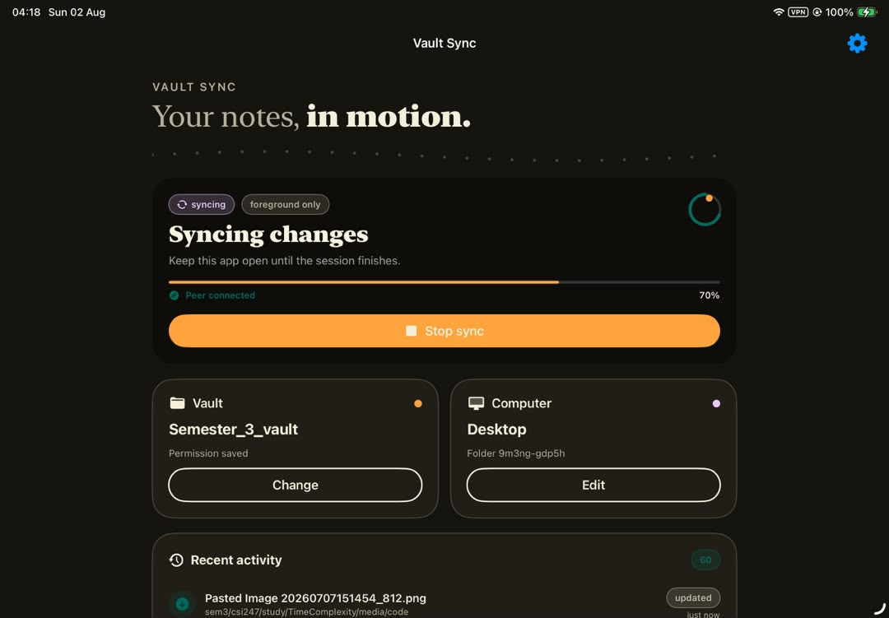
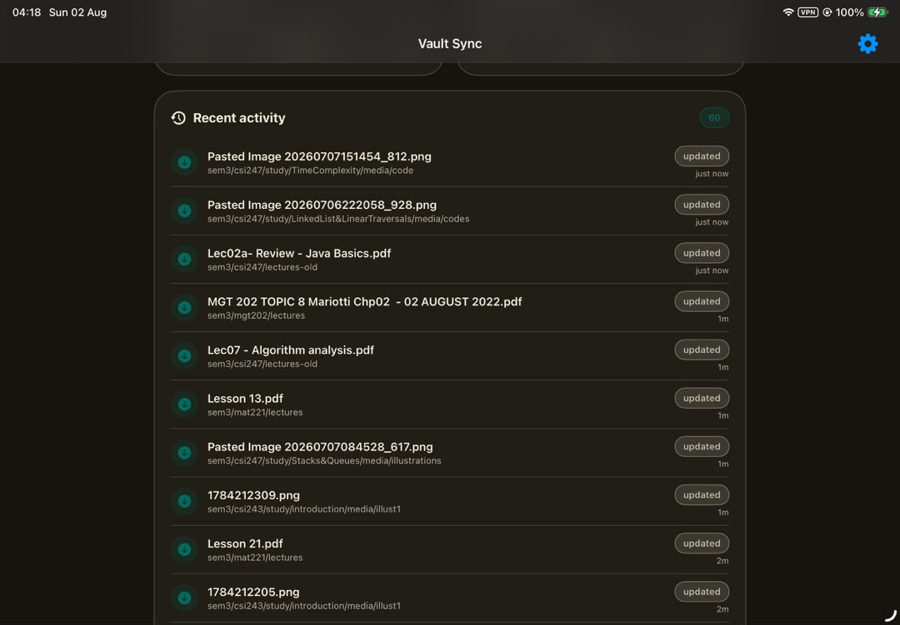
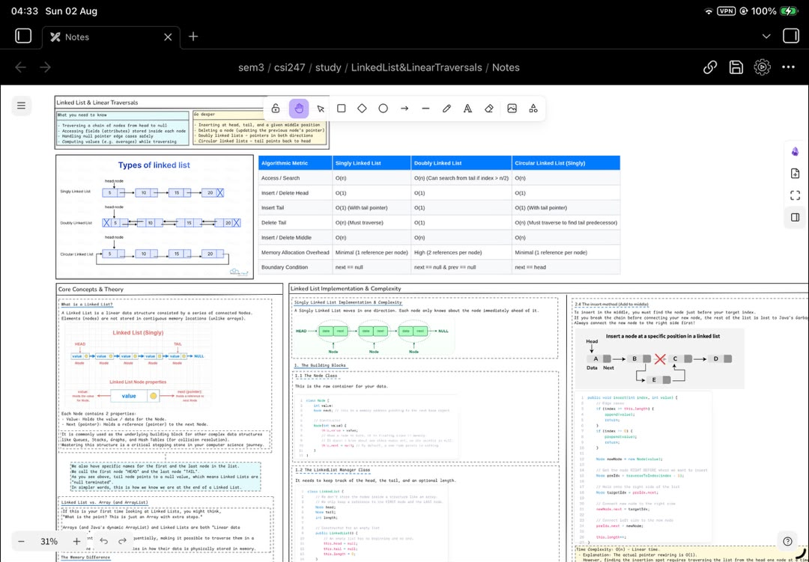

# Windows to iPad to Obsidian: complete setup guide

This is the tested, desktop-first installation and setup path for Vault Sync.
It is for someone who already keeps an Obsidian vault on a Windows PC with
Syncthing and wants the iPad to join that existing shared folder.

The application is open source, but it is still a development build. Use a
backed-up vault, enable Syncthing file versioning, and prove both transfer
directions with disposable notes before trusting it with important work.

## What this setup does

```text
Existing Windows vault
        ↕ Syncthing Send & Receive
Vault Sync on iPad (while open)
        ↕ same local folder
Obsidian on iPad
```

The Windows folder is established first. The iPad joins the existing Syncthing
folder by using the same **Folder ID**. Vault Sync does not use Obsidian Sync,
iCloud Sync, or a hosted Vault Sync account.

Vault Sync embeds Syncthing and configures the iPad folder as **Send & Receive**.
Files created, changed, renamed, or deleted on either side can therefore be
propagated to the other side.

## Important limitations

- Vault Sync is foreground-only. Keep it visible and keep the iPad awake until
  the session reports a verified result.
- Switching to Obsidian, Files, or another app stops an active session.
- The current session has a bounded runtime of about three minutes. A large
  initial import may require pressing **Sync now** again. Syncthing resumes
  already transferred data rather than intentionally starting the vault over.
- Syncthing is synchronization, not backup. Deletions also synchronize.
- A free Apple Personal Team signature normally expires after seven days and
  must be refreshed or installed again.
- One saved vault/computer profile is the current supported baseline.

## Before starting: protect the desktop vault

1. Close Obsidian on every device.
2. Copy or ZIP the complete desktop vault to a location outside every
   Syncthing folder.
3. In desktop Syncthing, open the vault folder's **Edit → File Versioning**.
4. Enable **Staggered File Versioning** or another suitable versioning policy.
5. Confirm the desktop folder reports **Up to Date** before adding the iPad.

Syncthing versioning is configured separately on each device and is disabled by
default. Versioning on the PC preserves old PC copies when a remote device
replaces or deletes them. It does not replace the independent backup above.

See the official Syncthing documentation for
[folder types](https://docs.syncthing.net/users/foldertypes.html) and
[file versioning](https://docs.syncthing.net/users/versioning.html).

## Requirements

- A Windows 10 or Windows 11 PC.
- An iPad, USB data cable, and the iPad passcode.
- An Apple Account with two-factor authentication available.
- Obsidian installed on the iPad.
- Syncthing installed on the PC with an existing vault folder.
- A GitHub account to download Actions artifacts.
- [Sideloadly](https://sideloadly.io/) for Windows.
- The web/direct-download editions of Apple iTunes and iCloud requested by
  Sideloadly, not their Microsoft Store editions.

Sideloadly is a third-party tool and is not part of this repository or Apple.
Download it only from its official site. Never commit Apple credentials,
verification codes, certificates, provisioning profiles, or device IDs.

## Part 1: create the Obsidian destination first

This is the recommended path for a fresh iPad setup. Do it before the first
Vault Sync transfer.

1. Open Obsidian on the iPad.
2. Open the vault switcher and choose **Create new vault**.
3. Give it the name that should appear on the iPad.
4. Create it as a local vault. Do not enable iCloud and do not connect Obsidian
   Sync for this workflow.
5. Close Obsidian completely.
6. Open **Files → Browse → On My iPad → Obsidian**.
7. Long-press the new vault folder and select **Favorite**.

The resulting destination is:

```text
On My iPad/Obsidian/<Vault Name>
```

Obsidian on iPad does not provide a general-purpose "open any folder" workflow.
Its local vault needs to live inside the dedicated Obsidian location. Favoriting
the vault also makes it easier to reach from Vault Sync's system folder picker.

If `On My iPad/Obsidian` does not yet exist, creating this local vault causes
Obsidian to initialize it. Apple documents the Files actions used here in
[Organize files and folders in Files on iPad](https://support.apple.com/guide/ipad/organize-files-and-folders-ipadeb120505/ipados).

## Part 2: build the unsigned IPA with GitHub Actions

GitHub's hosted macOS runner compiles the Go core, produces the XCFramework,
builds the Swift application, runs the native iPad Simulator tests, and packages
an unsigned physical-device IPA.

### From this repository

1. Open the repository's **Actions** page.
2. Open **iOS checks**.
3. Select a successful run for the commit you want to install.
4. Under **Artifacts**, download `ObsidianSync-unsigned-device-ipa`.

### From your own fork

1. Fork this repository on GitHub.
2. Enable Actions in the fork if GitHub asks.
3. Open **Actions → iOS checks → Run workflow**.
4. Choose the desired branch and start the workflow.
5. Wait for the complete workflow to pass, then download the artifact above.

Extract the downloaded ZIP. It contains:

```text
ObsidianSync-unsigned.ipa
ObsidianSync-unsigned.ipa.sha256
```

Optionally verify the IPA in PowerShell:

```powershell
Get-FileHash .\ObsidianSync-unsigned.ipa -Algorithm SHA256
Get-Content .\ObsidianSync-unsigned.ipa.sha256
```

The hexadecimal values must match. Actions artifacts are temporary, so rerun
the workflow when a fresh artifact is required.

## Part 3: prepare Windows for sideloading

1. Install the latest Windows build from
   [sideloadly.io](https://sideloadly.io/).
2. Install the web/direct-download iTunes and iCloud packages linked by
   Sideloadly. Remove the Microsoft Store editions first if present.
3. Restart Windows when the Apple components request it.
4. Connect the unlocked iPad by USB.
5. Tap **Trust** on the iPad and enter its passcode.
6. Confirm the iPad appears in iTunes and Sideloadly.

Sideloadly's current Windows requirements and automatic-refresh behavior are
documented on its [official site](https://sideloadly.io/) and
[FAQ](https://sideloadly.io/faq.html).

## Part 4: sign and install the IPA

1. Open Sideloadly normally, without passing command-line arguments.
2. Confirm the connected iPad is selected under **iDevice**.
3. Drag `ObsidianSync-unsigned.ipa` into the Sideloadly window.
4. Enter the Apple Account used for personal development signing.
5. Keep **Use automatic bundle ID** enabled.
6. Leave **Use custom entitlements**, **Enable File Sharing**, and tweak
   injection disabled.
7. Select **Start**.
8. Complete Apple's password and two-factor prompts only inside Sideloadly's
   authentication flow.
9. Wait for Sideloadly to report a successful installation.

Do not launch Sideloadly with the IPA path as a command-line argument. In the
tested Windows setup, doing that confused the auto-refresh helper and produced:

```text
Ipa file -r does not exist
Caching failed: CreateFile -r
```

Opening Sideloadly normally and dragging the IPA into its window avoids that
failure.

## Part 5: trust the development app

When the iPad reports **Untrusted Developer**:

1. Open **Settings → General → VPN & Device Management**.
2. Select the development identity for the Apple Account used in Sideloadly.
3. Choose **Trust**, or **Allow & Restart** on newer iPadOS versions.
4. Follow the confirmation instructions after restart.

If requested, also enable:

1. **Settings → Privacy & Security → Developer Mode**.
2. Select **Restart**.
3. After restart, unlock the iPad, select **Enable**, and enter the passcode.

The iPad must be online while verifying the developer identity. Apple documents
the current trust workflow in
[Install custom apps on iOS and iPadOS](https://support.apple.com/118254) and
[Developer Mode](https://developer.apple.com/documentation/xcode/enabling-developer-mode-on-a-device).

## Part 6: collect the two Syncthing device IDs

There are two different IDs:

- **iPad device ID:** displayed by Vault Sync under **This iPad** and as a QR
  code.
- **Desktop device ID:** displayed by Syncthing on the PC under
  **Actions → Show ID**.

Do not substitute a device name, folder label, IP address, or Apple device
identifier for a Syncthing device ID.

## Part 7: add the iPad to desktop Syncthing

1. Open Vault Sync and leave it visible long enough to display its device ID.
2. On the PC, open Syncthing and select **Add Remote Device**.
3. Paste or scan the iPad device ID.
4. Give it a recognizable name such as `iPad`.
5. Save the device.
6. Edit the existing desktop vault folder.
7. Under **Sharing**, enable the new iPad device and save.
8. Under the folder's **General** settings, copy the exact **Folder ID**.

The Folder ID is not the folder's display label and is not its Windows path.
Vault Sync must use the exact ID of the already established desktop folder.

The iPad may appear disconnected whenever Vault Sync is closed because its
embedded Syncthing engine runs only during a foreground session.

## Part 8: configure Vault Sync on the iPad

1. Open Vault Sync.
2. In the setup checklist, choose the vault.
3. In the system picker, open **Favorites** and select the local Obsidian vault
   created in Part 1.
4. Open the computer settings.
5. Enter or scan the desktop Syncthing device ID.
6. Enter a display name such as `Desktop`.
7. Leave the optional TCP address empty to use Syncthing discovery and relays.
8. Enter the exact desktop **Folder ID**.
9. Save the settings.

"Settings saved" does not mean the peer has connected. The first real
connection is proved only by running a sync session.

## Part 9: run the first transfer

1. Close Obsidian on the iPad.
2. Open Vault Sync and tap **Sync now**.
3. Accept the iPadOS **Local Network** permission if requested.
4. Keep Vault Sync visible and keep the iPad awake.
5. Watch for **Peer connected**, file activity, and increasing completion.
6. Wait for **Verified / Vault is up to date**.
7. If a large first transfer reaches the current session limit, start another
   foreground session and let Syncthing resume.
8. Open Obsidian only after Vault Sync has stopped the engine safely.



The activity list shows actual paths and completed changes observed during the
foreground session:



After the verified transfer, the same local folder opens normally in Obsidian:



## Part 10: prove two-way synchronization

Do not infer two-way behavior only from a progress bar. Prove it with disposable
files:

1. On the PC, create `desktop-to-ipad-test.md` with unique text.
2. Run Vault Sync to a verified result.
3. Open Obsidian and confirm the note and exact text appear.
4. In Obsidian, create `ipad-to-desktop-test.md` with different unique text.
5. Close Obsidian and run another verified Vault Sync session.
6. Confirm the iPad-created note appears on the PC.
7. Delete one disposable test note on the iPad, sync again, and confirm the
   deletion reaches the PC.

The 2026-08-02 physical test completed all three directions: desktop-to-iPad,
iPad-to-desktop, and an iPad deletion propagated back to the desktop.

## Normal daily workflow

Before editing on the iPad:

1. Close Obsidian.
2. Open Vault Sync.
3. Run a verified sync.
4. Return to Obsidian and edit.

After editing on the iPad:

1. Close Obsidian.
2. Open Vault Sync.
3. Run another verified sync.
4. Confirm the desktop receives the changes before editing the same notes there.

Avoid editing the same note on both devices between sessions. Syncthing keeps
conflict copies when it detects competing versions, but conflicts still require
manual review.

## Migration: the vault was already synced into `On My iPad` root

Use this only if the first transfer was pointed at a folder such as:

```text
On My iPad/Semester_3_vault
```

instead of:

```text
On My iPad/Obsidian/Semester_3_vault
```

Changing an indexed folder directly to an empty destination can make missing
files look like deletions. Use a copy-first migration:

1. Wait for desktop Syncthing to report **Up to Date**.
2. Pause the desktop Syncthing folder.
3. Make another independent desktop backup.
4. Close Vault Sync and Obsidian.
5. In Files, copy the complete root vault folder.
6. Paste the copy into `On My iPad/Obsidian`.
7. Keep the original root folder as a rollback copy.
8. Force-close and reopen Obsidian; confirm the copied vault is listed and its
   notes open.
9. In Files, favorite the copied folder.
10. In Vault Sync, choose **Change vault → Favorites** and select the copy.
11. In Vault Sync Settings, run **Test access**.
12. Unpause desktop Syncthing.
13. Run a verified session while watching the desktop for unexpected deletes.
14. Repeat the two-way disposable-note test.
15. Keep the old root copy for several days. Delete it only after repeated
    successful sessions and another backup.

Never press Syncthing's **Override Changes** or **Revert Local Changes** during
this migration unless you fully understand which side will win.

## Refresh or update the sideloaded app

Apple states that free Personal Team provisioning profiles expire after seven
days. Sideloadly can refresh enrolled apps when the PC can reach the iPad over
USB or configured Wi-Fi sync.

For an updated build:

1. Download and extract the new successful IPA artifact.
2. Open Sideloadly normally.
3. Drag in the new IPA.
4. Use the same Apple Account and automatic bundle ID.
5. Install without deleting the existing app first.

Using the same identity allows the installation to replace the old build while
normally preserving its app data. Deleting the app first removes its saved
bookmark, computer profile, Syncthing identity, and local engine state.

Apple documents current Personal Team limits in
[Developer account overview](https://developer.apple.com/help/account/basics/about-your-developer-account).

## Troubleshooting

### Sideloadly says `Ipa file -r does not exist`

Close Sideloadly and its daemon. Reopen Sideloadly without an IPA command-line
argument, then drag the IPA into the window.

### Sideloadly cannot see the iPad

- Unlock and reconnect the iPad.
- Accept the iPad's **Trust** prompt.
- Try another data-capable USB cable or port.
- Reinstall the web versions of iTunes and iCloud, then restart Windows.
- Confirm Apple Mobile Device Support and Bonjour are installed.

### The app says Untrusted Developer

Use **Settings → General → VPN & Device Management**, select the development
identity, and trust or allow it. Enable Developer Mode if requested.

### The Obsidian folder is missing from Vault Sync's picker

Create a local vault in Obsidian first. In Files, long-press that vault folder
and select **Favorite**. Then choose it from **Favorites** in Vault Sync's picker.

### The desktop is configured but the iPad remains disconnected

- Keep Vault Sync in the foreground.
- Confirm the desktop device ID was entered on the iPad.
- Confirm the iPad device ID was added on the desktop.
- Confirm the desktop folder is shared with the iPad device.
- Confirm the exact same Folder ID is used on both sides.
- Enable Local Network permission for Vault Sync in iPad Settings.
- If discovery is blocked, configure an explicit `tcp://host:22000` address.

### Progress pauses and later resumes

Syncthing may be scanning, reconnecting, hashing, or transferring a large file.
Keep the app visible. Check **Settings → Session log & diagnostics** and desktop
Syncthing. Start another foreground session if the bounded session ends before
the first import reaches a verified state.

### The free-signed app stops opening

Its provisioning profile probably expired. Refresh it through Sideloadly or
install the current IPA again with the same Apple Account and bundle ID.

## Security and privacy

- Vault data travels through the embedded Syncthing protocol; this project does
  not operate a hosted vault service.
- The Syncthing identity, configuration, database, and structured logs remain
  inside the app container, not inside the Obsidian vault.
- Exported diagnostics intentionally omit vault names and paths, device IDs,
  peer labels, folder IDs, addresses, keys, and raw error strings.
- Sideloadly and Apple authentication are separate from this repository. Never
  publish credentials, verification codes, signing certificates, or profiles.
- Review the source, build from a fork, and verify the artifact checksum when
  the threat model requires independent provenance.

## Getting help

When reporting a problem, include:

- the commit and GitHub Actions run used to build the IPA;
- Windows, iPadOS, Sideloadly, and Syncthing versions;
- whether the iPad was connected by USB or Wi-Fi;
- the visible Vault Sync phase and percentage;
- whether desktop Syncthing reported the peer connected;
- a redacted diagnostic report; and
- exact reproduction steps using a disposable vault.

Never include Apple credentials, full Syncthing device IDs, private addresses,
vault contents, certificates, or provisioning profiles in an issue.
